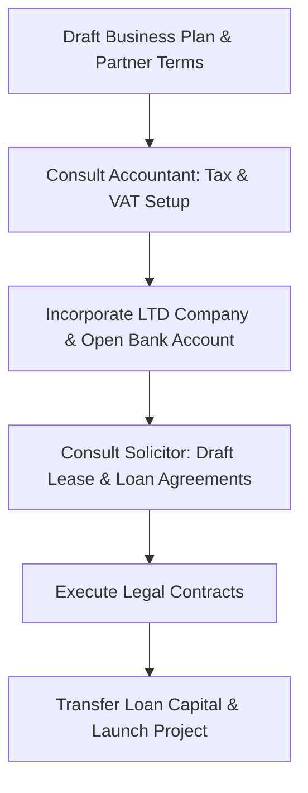

# Hopnest Limited Company Setup & Advisory Guide

This guide outlines the immediate, fast-tracked steps required to establish **Hopnest LTD** before your first guests arrive on **17th July**. Because you are dealing with a family farm partnership, agricultural land, and inter-entity financing, setting up these arrangements correctly from day one is critical to protect your investment and maintain healthy family relationships.

---

## 🚨 Emergency 18-Day Fast-Track Protocol
**First Guests Arrive: 17th July**  
Because guest stays are imminent, you must bypass the standard 4–8 week legal and banking processes. Follow this schedule to ensure you are legally protected, bank-account-ready, and fully insured:

### Day 1–2 (Tomorrow & Wednesday): Immediate Online Incorporation
* **Action:** Do not wait for a face-to-face meeting with your accountant. Incorporate the company online immediately (using a formation agent like *1st Formations* or *Rapid Formations*, or ask your accountant to file it *tomorrow morning* as an urgent request). Online incorporation costs £12–£50 and typically takes 24 hours.
* **Why:** You need the LTD's company number to open the bank account and update the insurance.

### Day 3–4 (Thursday/Friday): Open a Digital Business Bank Account
* **Action:** The moment you receive your Certificate of Incorporation, apply online to a digital business bank (**Starling Bank**, **Mettle**, or **Tide**). 
* **Why:** Digital banks typically approve accounts and issue details (Account Number and Sort Code) within 24–72 hours. **Do not use a traditional high-street bank** (like Barclays or Lloyds), as their compliance checks take 2 to 4 weeks.

### Day 5 (Friday/Monday): Transfer Capital & Link the Payment Gateway
* **Action:** 
  1. Have the farm partnership transfer the £40,000 startup capital straight into the new business bank account.
  2. Instantly update your Stripe/payment gateway inside **Bookalet** to route all incoming guest payments (including final balances for the July 17th bookings) directly into the new LTD bank account.

### Day 6–7: Update Farm Insurance to cover the LTD Company
* **Action:** Because the farm partnership already has public liability cover for the glamping site, you **must contact the insurance broker immediately** (the moment the LTD is incorporated) and ask them to add the new LTD company name to the policy as a **Joint Insured** or **Additional Policyholder**. 
* **Why:** If a guest sues "Hopnest LTD" (the company they booked with), but the insurance policy is only in the name of the "Farm Partnership," the insurer can refuse to pay the claim. Brokers (especially farm specialists like NFU Mutual) do this regularly and can issue the updated certificate in 24–48 hours.

### Day 8–10: Draft Interim "Licence to Occupy" & Loan Memo
* **Action:** Tell your solicitor you need a **1-page interim Licence to Occupy** and an **Interim Loan Memo** drafted immediately. A full 10-year commercial lease takes weeks; a Licence to Occupy gives your LTD company immediate, temporary legal right to use the land and run the business starting July 15th, protecting your insurance validity. The formal lease can be finalized in August.

### Day 11 onwards: Submit VAT Registration (VAT Pending Status)
* **Action:** Apply for VAT online immediately. While waiting for the VAT number (which takes 2–4 weeks), you can trade in "VAT registration pending" status. Talk to your accountant about how to adjust prices or invoice details during this transition.

---

## 1. Why Use an LTD Company vs. an "Arm" of the Farm Partnership?
It can be tempting to run the glamping business within the existing farm partnership to save on initial setup costs. However, doing so introduces significant legal, tax, and relationship risks:

* **Liability Protection (The Shield):** A partnership has no separate legal identity, and partners share **joint and several liability**. If a guest suffers a severe injury at the glamping site and sues, the lawsuit goes against the *entire farm partnership*. This puts the farm's land, farm machinery, farm bank accounts, and every partner's personal home at risk if insurance fails to cover the claim. An LTD company limits liability strictly to the assets owned by the company (the huts, tipis, and company cash).
* **Farm Inheritance Tax Protection (APR & BPR):** Working farms qualify for **Agricultural Property Relief (APR)**, allowing land to pass to the next generation free of Inheritance Tax (IHT). However, if you change agricultural land into commercial glamping land, that land loses APR. If the land is leased to a separate LTD company on a commercial basis, the farm partnership remains a clean agricultural business. Mixing too much commercial "leisure" activity directly inside the farm partnership can jeopardize the partnership's overall status for Business Property Relief (BPR) and APR, creating a massive future tax bill for the family.
* **Cash Flow & Partnership Protection:** In a partnership, all cash goes into one bucket. If the farm has a bad harvest or high feed costs, the glamping income might automatically be used to pay off the farm's bank overdraft, leaving you with no cash to pay yourself, pay for laundry, or grow the business.
* **Personal Income Tax vs. Corporation Tax:** Partnership profits are allocated to partners annually and taxed as personal income immediately (often at 40% or 45% for high earners), whether you leave the money in the business to buy new huts or not. LTD profits are subject to Corporation Tax (19% to 25%). You can keep profits in the company to repay the £40,000 loan tax-efficiently without triggering high personal income tax rates. You only pay personal tax (dividends/salary) when you physically extract money for yourself.
* **Succession:** If you want to sell the glamping business in the future, or hand it over to your children, you can easily transfer the shares of the LTD company. If it is run within the partnership, you cannot sell it without renegotiating the entire farm partnership agreement and title deeds.

---

## 2. Professional Consultations

### Speak to a Chartered Accountant First
Before you register anything, book a consultation with an accountant. If possible, use the same accountant who handles the farm partnership’s taxes, as they already understand the farm's financial structure and VAT status.

* **VAT on Pre-incorporation Assets:** Since the farm partnership has already paid for capital items (groundworks, shepherd's huts, materials), we must transfer these assets to the new LTD company:
  * **VAT Reclaim:** Under HMRC rules, a newly VAT-registered LTD company can reclaim VAT on **goods** (like the shepherd's huts, furniture, or equipment) bought up to **4 years** before incorporation (provided they are still held at the date of registration) and **services** (like groundworks, plumbing, or design) bought up to **6 months** before. 
  * **If the farm has already claimed the VAT:** The farm partnership can sell the assets to the LTD company at cost plus VAT. The LTD company will then reclaim this VAT on its first VAT return, making it cash-neutral.
* **Structuring the "Paper Loan" (£40,000 over 5 Years):** Since the farm has already paid for the capital, you do not need to transfer physical cash. Instead, the farm partnership sells the glamping assets to the LTD company on credit. This creates an **intercompany debt (loan)** of £40,000 where the LTD company owes the farm. The LTD then repays this debt over 5 years starting in 2027.
* **Capital Allowances:** By selling the assets to the LTD, the LTD officially owns them and can claim the **100% Annual Investment Allowance (AIA)**, writing off the entire £40,000 against its first-year profits to pay £0 corporation tax.

#### 💡 Questions to ask the Accountant:
1. *"Since the farm partnership has already paid for the glamping capital, should they sell the assets to the LTD company on credit to establish the £40,000 loan, and how do we handle the VAT invoicing to ensure the LTD can fully reclaim the VAT?"*
2. *"Can we reclaim VAT on the groundworks (services) under the 6-month pre-incorporation rule, and the huts (goods) under the 4-year rule?"*
3. *"Can the LTD claim the 100% Annual Investment Allowance (AIA) on these transferred huts to offset our first-season corporation tax?"*
4. *"Is a rent-free first season followed by a 5% gross turnover-linked rent tax-efficient for the farm partners' individual income tax, and does it satisfy HMRC's transfer pricing rules?"*
5. *"Can you handle the incorporation of the LTD company, register it for Corporation Tax, and assist with setting up the payroll/VAT schemes if required?"*

---

### Speak to a Commercial Solicitor
Once the accountant confirms the tax structure, a solicitor must draft the actual legal boundaries between you and the other four partners. Do not use generic internet templates for this.

* **Land Tenure: FBT vs. Commercial Lease:** Since the land is being used for a diversified non-agricultural business (glamping), a standard Commercial Lease is usually more appropriate than a Farm Business Tenancy (FBT). You will want to ensure the lease is protected under the Landlord & Tenant Act 1954 (giving you a statutory right to renew) or negotiate a secure fixed term (5–10 years).
* **Key Lease Elements:**
  * *Demised Area:* Clear boundaries of the glamping site (including parking and communal spaces).
  * *Rights of Access:* Explicit rights of way for guests and service vehicles across farm tracks.
  * *Utility Services:* Rights to connect to and use farm water, electricity, and drainage.
  * *Reinstatement:* What happens at the end of the lease? Do you have to remove the shepherd's huts and restore the land to pasture?

#### 💡 Questions to ask the Solicitor:
1. *"Should we use a standard Commercial Lease or a Farm Business Tenancy (FBT) for the glamping area, given it is a farm diversification project?"*
2. *"Can we secure a 10-year lease with a tenant-only break clause at year 5, and ensure the lease includes explicit rights of access for guests and connection to farm utilities?"*
3. *"How should we structure the Loan Agreement so it protects the farm partnership’s capital but gives the LTD company a 'grace period' during the off-season or startup phase?"*
4. *"Does the existing Farm Partnership Agreement need to be amended to formally permit this diversification and outline how rental income from the LTD is split among the partners?"*

---

## 3. Preparatory Documents for Meetings

### Draft A: 1-Page Business Plan Blueprint
* **The Goal:** 5-star organic glamping retreat (Martley, Worcestershire) targeting couples and families looking for peace and nature.
* **Assets:** 2x luxury Shepherd's Huts, 2x Tipis/Bell Tents.
* **Capital Cost (Loan Amount):** **£40,000** (covers unit purchase, groundworks, utility hookups, and website/marketing).
* **Revenue Projections (Illustrative):**
  * *Nightly Rate:* £120 (average across year).
  * *Occupancy Rate:* 55% (~200 nights per year per unit).
  * *Projected Annual Income:* Number of units × nights × rate = £48,000 (excluding tents).
* **Operating Costs:** Rent to farm, loan repayments, booking platform fees (Bookalet), cleaning, utilities, insurance.

### Draft B: Informal "Heads of Terms" with Partners
Have an informal chat with the other four partners and write down agreed bullets on:
* **Proposed Rent Structure:** 
  * **First Season (2026):** Rent-free period (rent holiday during startup/setup).
  * **Subsequent Seasons (2027 onwards):** Rent set at 5% of gross booking revenues (turnover rent).
* **VAT on Rent:** Confirm whether the farm partnership will Opt to Tax the land, and if the LTD company will need to register for VAT.
* **Loan Repayment Term:** **£40,000 principal repaid over 5 years starting in 2027** (established via the sale/transfer of glamping assets from the farm partnership to the LTD on credit, creating a paper loan). No repayments due in the 2026 setup season.
* **Repayment Schedule:** Paid annually in October, or in seasonal instalments between May and September (to match summer booking cash flow).
* **Site Area:** Identify the exact field or woodland copse on a farm map.
* **Access & Services:** Agree that guests can use the main farm entrance/tracks and that utilities will be sub-metered from the farm supply.
* **Insurance:** Confirm that the farm partnership will add the new LTD company name to the existing farm policy as a joint insured immediately.

---

## 4. Sequential Action Plan

1. **Prep Phase:** Complete the 1-page business plan and agree on the informal "Heads of Terms" with the partners.
2. **Accountant Review:** Confirm the VAT position, FHL capital allowances status, and interest rate.
3. **Incorporation:** Incorporate the company (often done by the accountant) and set up the business bank account.
4. **Legal Drafting:** Instruct the solicitor to draft the Commercial Lease and Loan Agreement based on the accountant's tax guidance.
5. **Funding & Execution:** Sign the agreements, transfer the loan funds into the company account, and begin development.
